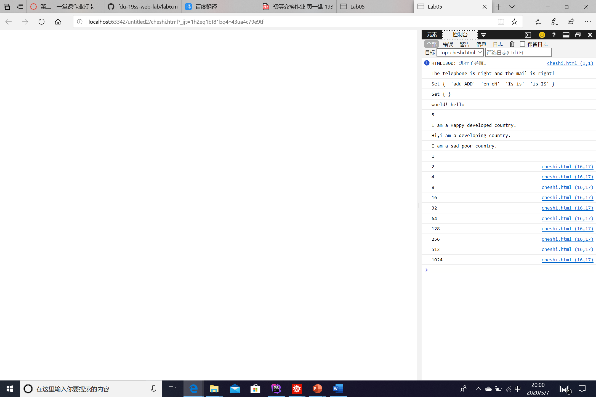

设计文档

一，正则表达式的解释：

1，移动手机电话：第一位数字为1，第二位数字为3到9，其他数字随便，一共11位数；

2，邮箱：以数字字母开头，中间可以是多个数组字母下划线或“-”；然后是“@”符号，后面是数字字母，然后是“.”符号加2-4个字母结尾；

二，	继承不同方式的理解：

1，	借助构造函数实现继承：缺点:只能解决属性的继承,使用属性的值不重复,但是父级类别的方法不能继承；

2，	借助原型链实现继承：缺点:因为Child的原型对象都是New Parent,所以实例化出来的对象的属性都是一样的,而且Parent上面的引用类型只要有一个实例对象修改了,其他也会跟着修改.因为他们原型对象都是共用的；

3，create：创建的对象是在原型上面的；

三，	Array，Set，Map的不同和使用：

1，	array：数组，可以存储对象和基本数据类型，长度固定。

2，	Set：元素无序，不重复，无索引。 

3，	Map：双列集合，用于存放键值对。键值是唯一的，不可重复。

四，命令行和控制命令：

！[命令]（images/1.png）

附：第六题未完成;

